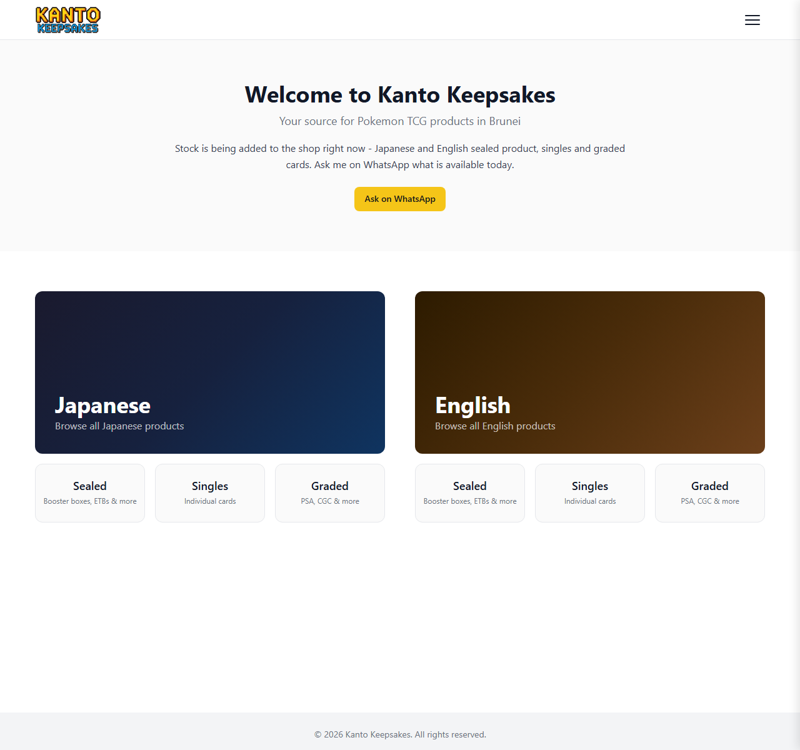
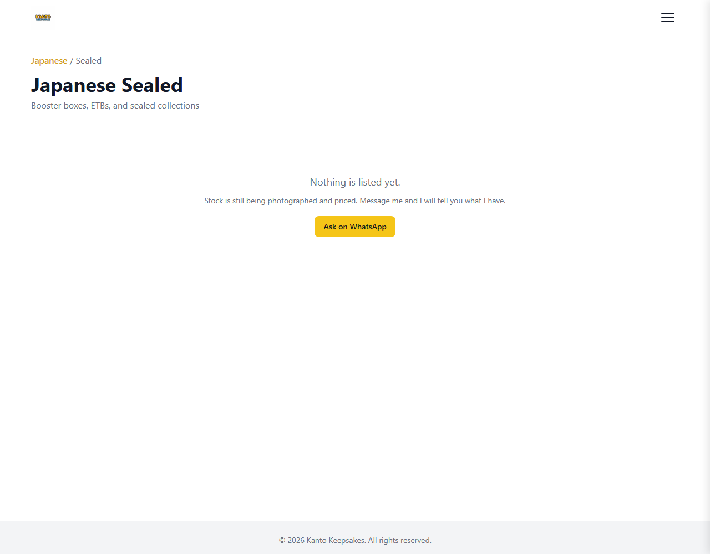
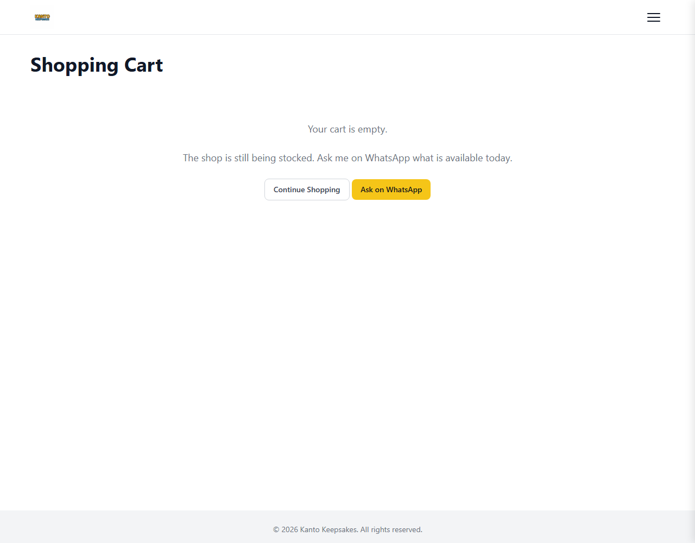

# Kanto Keepsakes

[](https://github.com/jaredoka/kantokeepsakes/actions/workflows/ci.yml)

A static e-commerce site for a Pokemon TCG business in Brunei Darussalam - graded cards, singles and
sealed product, priced in BND. Plain HTML, CSS and JavaScript. No framework, no build step, no
database, no API, no payment gateway.

> Built with AI-assisted development (Hermes Agent and Claude Code on Windows), the same workflow I
> used for [Shrimp Enthusiast](https://github.com/jaredoka/shrimp-enthusiast). Every decision in
> [`docs/DECISIONS.md`](docs/DECISIONS.md) is mine, including the ones about what not to build.

## Live

**https://kanto-keepsakes.pages.dev** - the custom domain moves over once the catalogue is stocked.

## What this project demonstrates

- **A tested money path.** The two things that can cost the shop real money - what a customer pays,
  and the exact text of the order - are covered by unit tests that run on every push.
- **Written decisions.** Eight entries in [`docs/DECISIONS.md`](docs/DECISIONS.md) recording what was
  chosen, what was rejected, and the consequence of each - including why there is no payment gateway.
- **Deleting code as part of the work.** Around 350 lines were removed before anything was added: a
  CSV importer, a JSON+`fetch` catalogue, sub-navigation JavaScript, a sort dropdown, a duplicate
  toast, and Google Fonts. Each duplicated something that already existed.
- **Release discipline.** The shop publishes to a preview URL first; the domain, the old projects and
  the data export are one deferred, gated release rather than a hurried cutover.

## Features

- **12 pages** - home, Japanese/English x sealed/singles/graded, accessories, preorder, cart, 404
- **Catalogue** driven by one file (`data/products.js`), with per-product stock caps
- **Cart** in `localStorage`: quantity controls, removal, BND totals, corrupt-storage guard
- **Checkout** composes a numbered order and opens WhatsApp with it prefilled
- **Empty states by design** - with no stock listed, every grid offers "ask me on WhatsApp" instead
  of a dead page
- **No third-party requests** - no fonts CDN, no analytics, no cookies
- **Security headers** via Cloudflare Pages `_headers`
- **SEO** - per-page titles and descriptions, `robots.txt`, `sitemap.xml`

## Built With


## How it works

```
public/index.html - public/pages/*.html   markup only - no inline business logic
public/css/styles.css                     design tokens at the top, then components
public/js/config.js                       company WhatsApp number, currency, storage key
public/js/money.js                        BND formatting - the only place money is formatted
public/js/cart.js                         cart state, totals, order message, checkout URL
public/js/products.js                     catalogue filtering, product cards, empty shop
public/js/app.js                          header menu and cart count
public/data/products.js                   THE CATALOGUE - the only file edited to list stock
```

Every page loads one `<script type="module">` that calls the functions it needs. The catalogue is
imported, not fetched, so nothing is asynchronous and the page cannot fail to load its own data.
The cart is the only state and it lives in `localStorage`, which is why there is no backend.

## Running it locally

```bash
npm install      # only needed for the tests
npm run serve    # http://localhost:8080 (serves public/)
```

Opening `public/index.html` from the file system will not work - the scripts are ES modules, which
browsers refuse to load over `file://`.

## Tests

```bash
npm test
```

Two files, nineteen tests, one dependency: BND formatting, and the cart (stock caps, quantity
arithmetic, removal, totals, corrupt storage, the order message, and that checkout points at the
right number).

## Adding a product

1. Put the photo in `public/images/products/`, named after the product's `id` - lowercase, dashes, resized
   to ~1200 px on the long edge and under 400 KB.
2. Add an entry to `PRODUCTS` in `public/data/products.js`. The field list and a copyable example are in the
   comment at the top of that file.
3. `npm test`, then commit and push. Cloudflare Pages deploys `main` automatically.

## Screenshots

| Home | Empty shop | Cart |
|---|---|---|
|  |  |  |

## Project structure

```
public/                                            the website - this directory is what deploys
tests/                                             nineteen tests, one dependency
docs/DECISIONS.md  docs/screenshots/                why it is built this way
.github/workflows/ci.yml                           tests on every push
wrangler.jsonc                                     deploy config: upload public/, 404.html on a miss
```

## Next

Stocking the catalogue; a "how to buy" page explaining the WhatsApp -> bank transfer -> collect flow.
Payments are deliberately out of scope - see decision 2.

## Rights

Code published as a portfolio reference. Product photography, the logo and written content are
(c) Kanto Keepsakes and may not be reused.
